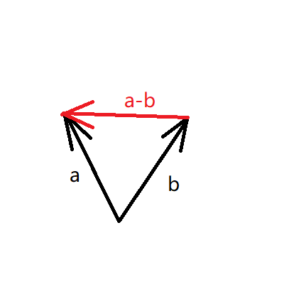

# 向量的减法

&emsp;&emsp;向量的减法和加法相似，假设有向量a和b，则a-b = (ax - bx,ay - by,az - bz)
&emsp;&emsp;减法的图像如下图所示

&emsp;&emsp;如果还用平行四边形思想来思考向量减法的意义，则向量减法是向量加法所得对角线的另一条对角线，以减号后面的向量的终点为起点，指向减号前面向量的向量的终点。
&emsp;&emsp;但是这种思考方式有点绕，可以把向量看成是点的坐标，a-b就是由b点指向a点组成的向量。
&emsp;&emsp;这就是向量的减法。
