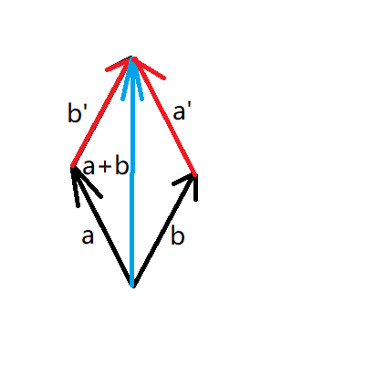

# 向量的加法

&emsp;&emsp;假设空间中有两个向量a和b。a+b = (ax+bx,ay+by,az+bz)。

&emsp;&emsp;如下图，a与a'平行且长度相等，b与b'平行且长度相等。a+b就相当于a,b,a',b'所围成的平行四边形的对角线。

&emsp;&emsp;也可以这么说，由向量a的起点出发，沿着a的方向走a的长度，然后沿着b的方向走b的长度，达到的点相当于从a的起点沿着a+b的方向走a+b的长度。

​	这就是向量的加法。