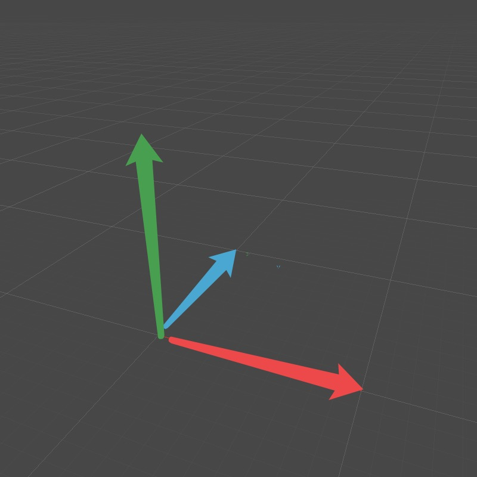

# 向量的外积

&emsp;&emsp;向量的外积在后续的章节涉及比较多。假设两向量a和b，axb = (aybz - azby , azbx - axbz , axby - aybx)。

&emsp;&emsp;向量的外积的结果得到的是一个向量，它的大小等于向量a和向量b所围成的平行四边形的面积。

&emsp;&emsp;向量的方向可以根据右手定则，右手的四指方向指向第一个矢量,屈向叉乘矢量的夹角方向（两个矢量夹角方向取小于180°的方向）,那么此时大拇指方向就是叉乘所得的叉乘矢量的方向。但是在Unity中，使用的是左手，因为Unity使用的是左手坐标系。

&emsp;&emsp;外积得到的向量的大小在数值上可以表示为|a x b|= |a||b|sin<a,b>，这就是向量a和b所围成的平行四边形的面积的表达式。

&emsp;&emsp;如下图中，蓝色向量代表a，红色向量代表b，绿色向量代表的就是axb的结果，因为是在Unity引擎上实现，所以要用左手去判断。

&emsp;&emsp;在表示一个平面的时候，通常使用不共线的三个点来表示，假设为点A，B，C。向量AB和向量AC的外积得到的结果就是该平面的法向量。

