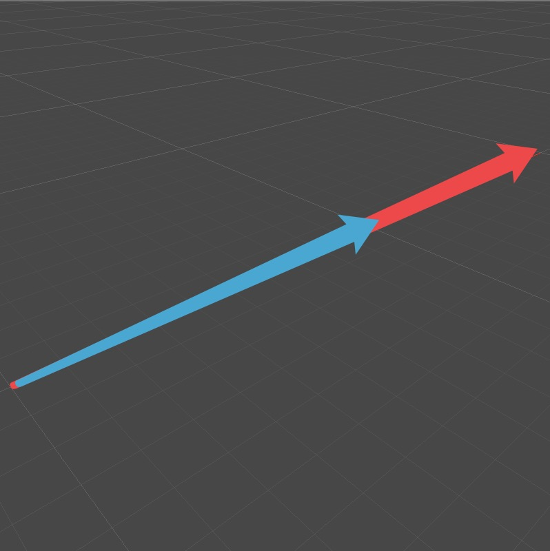

# 平行向量的除法

&emsp;&emsp;平行向量之间的除法的结果是一个实数，如下图所示，假设蓝色向量是a，红色向量是b，两向量的关系是b=2a，则b/a = 2

&emsp;&emsp;若向量b = at，则t = b/a(向量a不为零向量)。虽然公式是这么写，但是细细推导，可以将平行向量的除法用向量的点积表示。

&emsp;&emsp;试想想，两向量平行，b=at。则两向量的夹角只可能是0或PI，则cos<a,b>=1或-1。这表示的是向量b与向量a同向或不同向，如果t>0，则cos<a,b>=1，若t<0，则cos<a,b> = -1。在数值上，|t| = |b|/|a|。

&emsp;&emsp;由此，t = (|b|/|a|)cos<a,b> = (|b|/|a|)(ab/(|a||b|)) = ab/(|a|^2)

