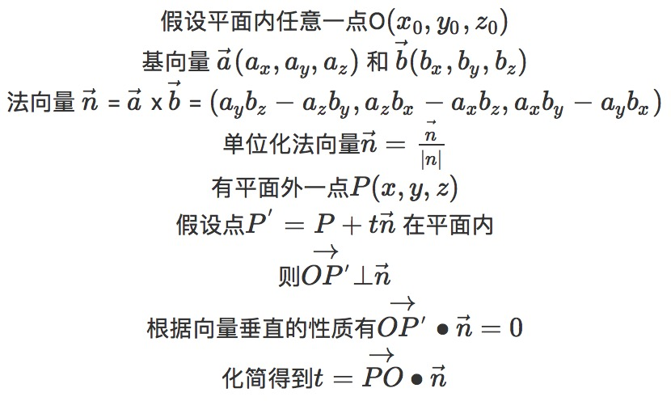

# 点与平面的最短距离

&emsp;&emsp;一个点到平面的最短距离，就是以该点为起点，向平面作一条垂线，该垂线的距离就是点到平面的最短距离。

&emsp;&emsp;如果根据平面内所有点的表达式，结合两点距离公式来推到最短距离，未免有点复杂了。简单的做法是根据平面内所有直线与法向量垂直的定理来推到点面距离的计算公式。

&emsp;&emsp;下面直接上推理过程。

&emsp;&emsp;计算得到t之后，结合法向量和点P坐标，可以计算出垂点的坐标，可以验证该点就在平面内。