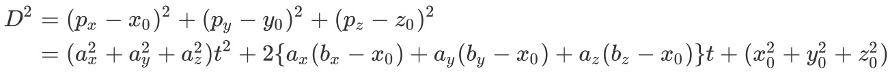
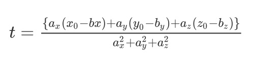

## 点到直线的最短距离

&emsp;&emsp;根据直线的表示方式，可以设一个点，任意一点到点P的距离可以根据两点间距离公式求出。

:-: 

&emsp;&emsp;然后根据对表达式求二阶导数，可以证明该函数存在最小值。

&emsp;&emsp;令一阶导数等于零可以求得取最小值时，t的取值。将t带入可以计算出最短距离的平方。最后算得

:-: 

## 点到线段的最短距离
&emsp;&emsp;根据点到直线的距离的计算方式，把线段看成是直线，最后计算出t，然后根据t的值将t缩小到[0,1]之间。

```
if t < 0
than t = 0
if t > 1
than t = 1
```
&emsp;&emsp;这样就可以计算点到线段的最短距离了。