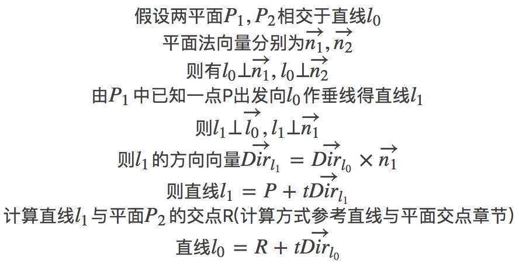

# 相交平面的交线

&emsp;&emsp;空间中两个平面要么相交要么平行，相交平面得到的是一条直线。

&emsp;&emsp;根据之前的博文有讲述，空间中不共线三点确定一个平面。那么已知两个平面，且两平面相交，应该如何去计算两平面之间的交线呢？

&emsp;&emsp;思路分析：如果两平面相交，获得一条直线，那么该直线就同时属于两个平面。那么该直线会同时垂直于两个平面的法线。那么两个平面的法向量的外积，就可以计算出交线的方向。这时候还需要计算交线上一点才能表示该直线。要计算交线上一点，就需要构造另一条直线，使得该直线在两个已知平面中的一个平面内，并且与另一个平面有交点，该交点就是交线上的点。而目前能够得到的已知量就是表示平面的六个点（这六个点可能会有相等的点，但是如果能表示平面，不会六个点都相等），交线方向向量，两个平面的法向量。可以取六个点中的一个点，作平行于交线的直线，结合该点所在平面的法向量得到第二条直线，根据向量外积，计算得到一个垂直于交线的向量，结合该点和该向量可以得到一条垂直于交线的直线，并且该直线交于另一个平面，求出该直线与平面的交点，该交点就是交线上的点，交线上的点和交线方向向量就可以确定交线了。

&emsp;&emsp;推导过程:

:-: 