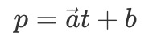
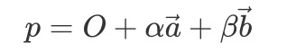

# 空间中的点线和面

&emsp;&emsp;在三维空间中，最基本的元素莫过于基本的点，线和面。

&emsp;&emsp;他们之间的关系，可以这样理解，点按着一定的方向平移可以得到直线，线按照一定的方向平移可以得到平面，这个结论想象一下就可以理解了。

&emsp;&emsp;可是要在数理逻辑上来表示这些元素，就需要根据一定的公理，定理来确定了。

## 表示空间中任意一个点

&emsp;&emsp;在三维空间中，要表示任意一个点可以使用三维坐标来表示点的位置信息。

&emsp;&emsp;因此，在三维空间中，一个点的位置信息可以表示为(x,y,z)。

## 空间中一条直线的表示

&emsp;&emsp;在二维空间中，一条直线的表示可以靠一个点的位置加上一个方向矢量来表达。在三维空间中也同样可以根据这样的手段来表达三维空间里的直线。

:-: 

&emsp;&emsp;其中b为直线上一个已知的点，a为直线的方向矢量，t为比例系数，计算得到的p就是直线上任意点的位置坐标信息了。

## 空间中平面的表示

&emsp;&emsp;空间中表示一个平面，可以根据该平面内一点，和法向量来确定，法向量确定的是平面的朝向。但其实这是根据一条公理进一步推论的。该公理的描述如下

:-: **不共线的三点确定一条直线**

&emsp;&emsp;根据这三点，以其中一点O为原点，计算两条向量 a，b，法向量 n 就等于a x b 。然后就可以使用O和法向量 n 来表示一个平面了。

&emsp;&emsp;但是在许多三维场景中，多边形物体都是通过一个个三角形面来表示的，而法向量是可以计算出来的。所以这里我推崇用不共线的三点来表示一个平面，在需要法向量的时候，根据三点计算即可，也可以提前计算好存储在变量中。

## 平面内任意一点的坐标

&emsp;&emsp;根据上一小节中平面的表示方法，可以推出平面内任意一点的坐标的表示方法。

&emsp;&emsp;首先我们根据点O,A,B计算两条向量 a ，b 。点O为该平面内原点，向量 a 和 b 为基向量。平面内所有点可以用以下的公式表示

:-:  